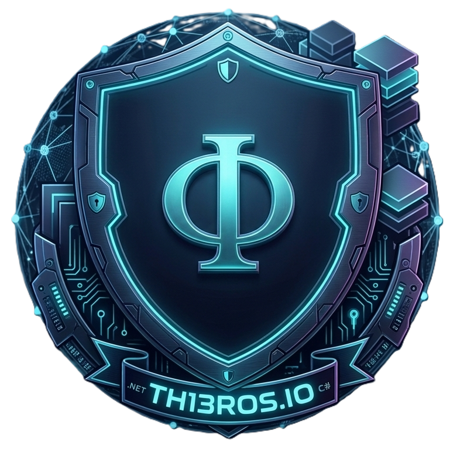
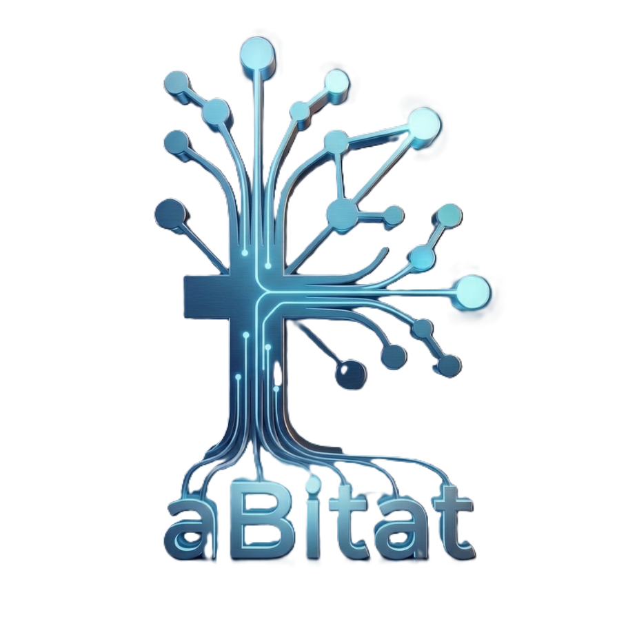
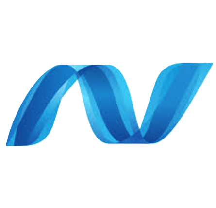
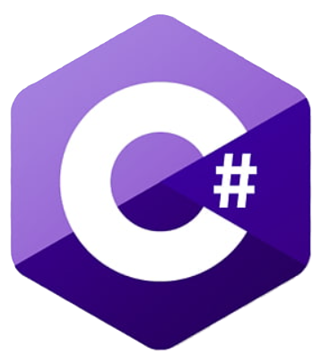
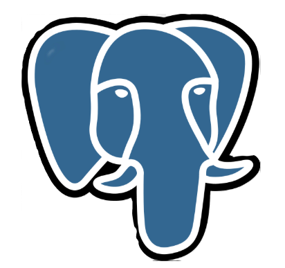
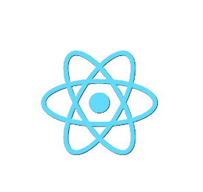
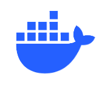
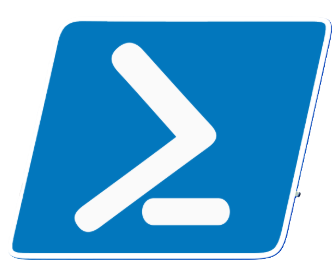
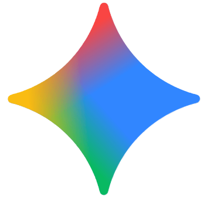

   

  
  &nbsp;&nbsp;&nbsp;&nbsp;&nbsp;&nbsp;&nbsp;&nbsp;&nbsp;&nbsp;
  
    
  <h1>Thierre Becker</h1>
  
  

    <code>Solutions Engineer</code> &nbsp;·&nbsp;
    <code>Cybersecurity Track</code> &nbsp;·&nbsp;
    <code>São Paulo, BR</code>
  

  
  &nbsp;

  

  &nbsp;
  
    
  

   
 

 
 
 
<table>
  <tr>
    <td align="center" width="90">
      <a href="https://th1eros.com/#/login">
         
        <b>.NET 8</b>
      </a>
    </td>
    <td align="center" width="90">
      <a href="https://th1eros.com/#/login">
         
        <b>C#</b>
      </a>
    </td>
    <td align="center" width="90">
      <a href="https://th1eros.com/#/login">
         
        <b>PostgreSQL</b>
      </a>
    </td>
    <td align="center" width="90">
      <a href="https://th1eros.com/#/login">
         
        <b>React 18</b>
      </a>
    </td>
    <td align="center" width="90">
      <a href="https://th1eros.com/#/login">
         
        <b>Docker</b>
      </a>
    </td>
    <td align="center" width="90">
      <a href="https://th1eros.com/#/login">
         
        <b>Terminal</b>
      </a>
    </td>
    <td align="center" width="90">
      <a href="https://th1eros.com/#/login">
         
        <b>Gemini</b>
      </a>
    </td>
  </tr>
</table>
 
 
 

DevSecOps

Construo sistemas funcionais com foco em infraestrutura real. Cada projeto é uma etapa deliberada de consolidação técnica, com olhar crescente em **cybersecurity**, **autenticação segura** e **arquiteturas resilientes**.

 

<table>
  <tr>
    <td valign="top" width="33%">

### 🛰️ Sistemas & Backend

**Ecossistema .NET** centrado em serviços robustos com **.NET 8** (Rapsodia) e interfaces multiplataforma com **.NET MAUI** (Orpheu).

**PostgreSQL** como padrão relacional — modelagem, escalabilidade e integridade referencial como requisitos, não opcionais.

**APIs RESTful** com camadas de serviço desacopladas, conectando [Papyros](https://th1eros.com/#/login) ao backend com tipagem estrita via TypeScript.

### 🛡️ Segurança & Governança

**JWT + Hashing** aplicados como padrão de autenticação e proteção de identidades em todos os projetos.

**Soft Delete & Timestamps** como cultura de auditoria — rastreabilidade de registros como requisito fundamental de arquitetura.

**Git Strategy** — versionamento com rastreabilidade histórica e integridade em ambientes organizacionais colaborativos.

### 🔍 Resiliência & IA

**Troubleshooting crítico** — diagnóstico de File System Locks, erros de registro de classe e estabilização de ambientes de produção.

**IA como alavanca** — uso estratégico de Gemini e Claude para análise de logs, refatoração e aceleração em novas stacks.

**Documentação técnica** orientada a onboarding real: READMEs que comunicam, não apenas registram.

## Projetos

| Projeto | Stack | Papel | Status |
|---|---|---|---|
| [**Rapsodia**](https://th1eros.com/#/login) | `.NET 8` · `C#` · `PostgreSQL` · `JWT` | API Core / Backend | `ativo` |
| [**Papyros**](https://th1eros.com/#/login) | `React 18` · `TypeScript` | Frontend / Dashboard | `ativo` |
| **Orpheu** | `.NET MAUI` · `C#` | App Multiplataforma | `em desenvolvimento` |
| [**Telemetry**](https://th1eros.com/#/login) | `PostgreSQL` · `Docker` | Observabilidade | `ativo` |
| [**aBitat**](https://th1eros.com/#/login) | `.NET` · `React` · `PostgreSQL` | Ecossistema / Startup | `em produção` |

 

---

 

> *Construir software seguro, estável e escalável —*
> *usando tecnologia como ferramenta estratégica, não como fim em si mesma.*

 

&nbsp;&nbsp;

&nbsp;&nbsp;

  

