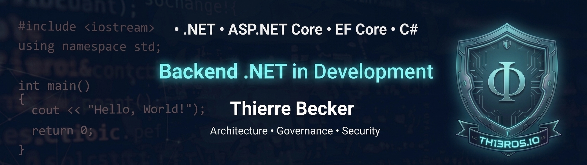

  
   
  

# 🛠️ Thierre Becker | Backend .NET in Development

### 🛠️ Strategic Tech Stack (CISO + CTO + CIO Approach)
- 🛡️ **Primary Layer**: Architecture • Governance • Security
- 🚀 **Core Frameworks**: .NET 8 | ASP.NET Core | EF Core
- 💻 **Languages**: C# | C++
- ⚙️ **Tools**: Git | GitHub | VS Code | Visual Studio

---

### 🎯 Evolution Goals
1. 🔢 **Mathematics**: From zero to advanced (Arithmetic and Logic).
2. ⚡ **Low-Level Performance**: C++ focused on performance and mathematical logic.
3. 🔗 **Integration**: Development of mathematical logic coded in C++.

---

  

